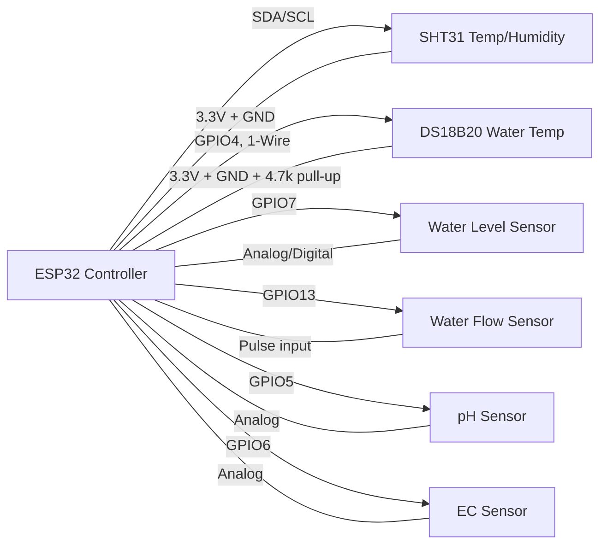

# Sensor Integration Guide

This guide explains how the Project L.E.A.F. firmware integrates sensors into the ESP32-based controller hardware and how the firmware reads those sensors.

## 1. Supported Sensors

The firmware currently integrates the following sensors:

- SHT31 temperature/humidity sensor (I2C)
- DS18B20 water temperature sensor (1-Wire)
- Water level sensor (analog or digital)
- Water flow sensor (digital pulse input)
- pH sensor (analog)
- EC sensor (analog)

## 2. Pin Mapping

The pin mapping is defined in `proleaf/include/Config.h`.

| Sensor | Pin | Interface | Notes |
|---|---|---|---|
| SHT31 | GPIO8 SDA / GPIO9 SCL | I2C | Uses `Adafruit_SHT31` library at I2C address `0x44` |
| DS18B20 | GPIO4 | 1-Wire | Requires 4.7k pull-up resistor to 3.3V |
| Water level | GPIO7 | ADC input or digital input | `WATER_LEVEL_SENSOR_TYPE` selects `analog` or `digital` |
| Water flow | GPIO13 | Digital interrupt | Falling-edge pulse counter with internal pull-up |
| pH | GPIO5 | ADC input | Analog input; max 3.3V |
| EC | GPIO6 | ADC input | Analog input; max 3.3V |

## 3. Sensor Wiring

Use the following wiring map for the ESP32 controller and the sensor board/breakouts.

### Recommended connections

- SHT31
  - VCC -> 3.3V
  - GND -> GND
  - SDA -> GPIO8
  - SCL -> GPIO9
  - Optional: 4.7k pull-up resistors from SDA and SCL to 3.3V if the breakout does not already include them.

- DS18B20
  - VCC -> 3.3V
  - GND -> GND
  - DATA -> GPIO4
  - 4.7k resistor between DATA and 3.3V

- Water level sensor (analog)
  - Output -> GPIO7
  - VCC -> 3.3V
  - GND -> GND
  - Ensure sensor output stays within 0-3.3V.

- Water level sensor (digital float switch)
  - Signal -> GPIO7
  - VCC -> 3.3V or sensor supply as required
  - GND -> GND

- Water flow sensor
  - Pulse output -> GPIO13
  - VCC -> 3.3V or sensor power supply
  - GND -> GND
  - Use a clean signal and a pull-up if the sensor needs one.

- pH sensor
  - Analog output -> GPIO5
  - VCC -> 3.3V or board power input
  - GND -> GND
  - If the sensor board outputs 5V, add a voltage divider or level shifter.

- EC sensor
  - Analog output -> GPIO6
  - VCC -> 3.3V or board power input
  - GND -> GND
  - If the sensor board outputs 5V, add a voltage divider or level shifter.

### Wiring rules

- Share a common ground between the ESP32 and every sensor.
- Power all sensors from the same 3.3V rail when possible.
- Do not drive ESP32 analog pins with voltages above 3.3V.
- Keep I2C wiring short and add pull-ups only if the sensor breakout does not provide them.
- Confirm the flow sensor output is compatible with 3.3V logic before connecting to GPIO13.

### Simple text wiring diagram

```text
ESP32          SHT31         DS18B20        Water Level   Water Flow   pH Sensor    EC Sensor
-------        ----          -------        -----------   ----------   ---------    ---------
3.3V   ------> VCC           VCC            VCC           VCC          VCC          VCC
GND    ------> GND           GND            GND           GND          GND          GND
SDA    ------> SDA
SCL    ------> SCL
GPIO4  --------------------> DATA
GPIO7  ---------------------------------> LEVEL
GPIO13 -------------------------------------------------> FLOW
GPIO5  ----------------------------------------------------------------> pH
GPIO6  ----------------------------------------------------------------> EC
``` 

Additional related definitions:

- `PH_ADC_RESOLUTION` = 12
- `PH_ADC_REFERENCE_VOLTAGE` = 3.3f
- `EC_ADC_RESOLUTION` = 12
- `EC_ADC_REFERENCE_VOLTAGE` = 3.3f
- `FLOW_SENSOR_PULSES_PER_LITER` = 450.0f

## 3. Hardware Wiring Diagram



> Note: The board’s default I2C pins are used for SHT31. If your breakout uses different pins, update the firmware accordingly.

## 4. Firmware Integration Flow

The main firmware uses `proleaf/src/main.cpp` and the `Sensors` class in `proleaf/include/Sensors.h` / `proleaf/src/Sensors.cpp`.

### Initialization

`Sensors::begin()` performs:

- `m_sht31.begin(0x44)` to initialize the SHT31 sensor
- `m_ds18b20.begin()` and `m_ds18b20.setResolution(12)` for the DS18B20
- `pinMode(WATER_LEVEL_PIN, INPUT)` for water level sensing
- `pinMode(FLOW_SENSOR_PIN, INPUT_PULLUP)` and `attachInterrupt(...)` for flow pulses
- `pinMode(PH_SENSOR_PIN, INPUT)` and `analogReadResolution(PH_ADC_RESOLUTION)` for pH
- `pinMode(EC_SENSOR_PIN, INPUT)` and `analogReadResolution(EC_ADC_RESOLUTION)` for EC

### Sensor Reading Cycle

`Sensors::read()` does the following in each cycle:

1. `readSHT31()`
   - Reads temperature and humidity via I2C
   - Validates ranges and updates `m_lastAirTemperature` / `m_lastHumidity`
2. `readWaterTemperature()`
   - Requests temperature from DS18B20 and validates the value
3. `readPH()`
   - Reads analog value from GPIO6
   - Converts ADC reading into voltage
   - Converts voltage into pH value using the formula:
     - `pH = 7.0 + (2.5 - voltage) / 0.05916 + PH_CALIBRATION_OFFSET`
4. `readEC()`
   - Reads analog value from GPIO6
   - Converts ADC reading into voltage
   - Applies `EC_CALIBRATION_FACTOR` to produce EC
5. `updateFlowReading()`
   - Every second, counts pulses from the flow sensor interrupt
   - Calculates liters and flow rate in L/min
6. `readWaterLevel()`
   - Reads water level as analog percentage or digital on/off state

### What is sent to the backend

The `SensorReadings` struct returned from `Sensors::read()` includes:

- `airTemperature`
- `humidity`
- `waterTemperature`
- `ph`
- `ec`
- `waterFlow`
- `flowRate`
- `totalFlow`
- `waterLevel`
- `batteryVoltage` (simulated)
- `signalStrength` (simulated)
- `sequenceNumber`

This struct is used later by `ApiClient::sendTelemetry()` to transmit sensor data to the backend API.

## 5. Sensor-Specific Notes

### SHT31

- Connect SDA/SCL to the ESP32 I2C bus.
- Use 3.3V power and common ground.
- If the breakout board does not include pull-ups, add 4.7k resistors from SDA and SCL to 3.3V.

### DS18B20

- Connect data to GPIO4.
- Use a 4.7k pull-up resistor between the data line and 3.3V.
- Share the ground with the ESP32.

### Water level

- For analog level sensors, connect the analog voltage output to GPIO7.
- For digital float switches, configure `WATER_LEVEL_SENSOR_TYPE` to `digital`.
- Ensure the output does not exceed 3.3V.

### Water flow

- Hall-effect turbine sensor: connect the **yellow pulse output** to GPIO13.
- The firmware counts falling edges on this pin via an ISR with a
  `FLOW_SENSOR_MIN_PULSE_INTERVAL_US` debounce (rejects bounce/EMI).
- Power the sensor at **3.3V** so its open-collector pulse output stays within
  ESP32 logic levels; `INPUT_PULLUP` holds the line HIGH at 3.3V. If the
  sensor/branch is 5V, use a level shifter or divider to 3.3V before GPIO13.
- Verify `FLOW_SENSOR_PULSES_PER_LITER` matches the ACTUAL installed sensor;
  do not assume the 450.0f (YF-S201) default without measurement.

### pH and EC

- Both sensors use ADC pins, so their output must stay within the ESP32 ADC range (0–3.3V).
- If the sensor board output is 5V, use a voltage divider or level shifter.
- Calibrate `PH_CALIBRATION_OFFSET` and `EC_CALIBRATION_FACTOR` in `Config.h`.

## 6. Validation Checklist

1. Power the ESP32 and verify it boots.
2. Open the serial monitor at `115200` baud.
3. Confirm the firmware prints:
   - `[SHT31] Initialized`
   - `[DS18B20] Initialized`
   - `[LEVEL] Initialized`
   - `[FLOW] Ready`
   - `[pH] Ready`
   - `[EC] Ready`
4. Confirm sensor values print during normal operation.
5. Confirm the backend receives telemetry from the ESP32.

## 7. Troubleshooting

- If SHT31 fails, check the I2C wiring and address.
- If DS18B20 returns invalid temperature, verify the pull-up resistor and water-proof probe.
- If pH or EC values are out of range, verify the analog wiring, use a divider, and calibrate the formula.
- If flow readings stay at zero, confirm the pulse wire, pull-up condition, and falling-edge detection.

## 8. How to Add a New Sensor

1. Add a pin definition to `Config.h`.
2. Add a new read method in `Sensors.h` / `Sensors.cpp`.
3. Initialize the sensor in `Sensors::begin()`.
4. Update `Sensors::read()` to call the new method and store its value in `SensorReadings`.
5. Update the backend schema if needed.

---

For hardware details, refer to `proleaf/docs/hardware-test-checklist.md` and `proleaf/include/Config.h`.
