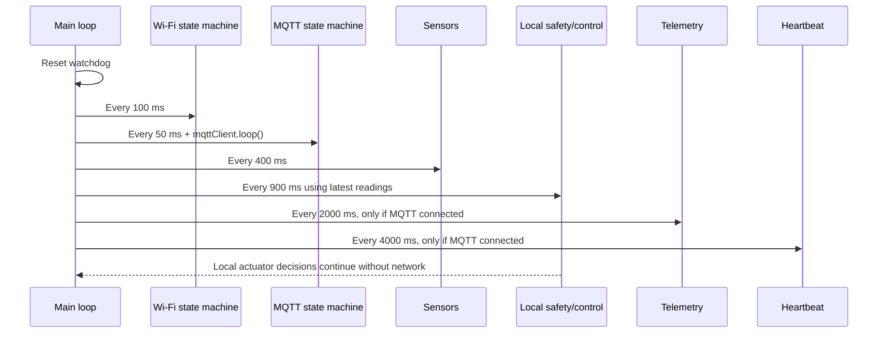

# Firmware Timing Audit

## Current timing values

| Task | Interval | Scheduling |
| --- | ---: | --- |
| Sensor acquisition | 400 ms | `millis()` deadline |
| Local safety/control | 900 ms | `millis()` deadline |
| Telemetry | 2000 ms | independent `millis()` deadline |
| Heartbeat | 4000 ms | independent `millis()` deadline |
| Wi-Fi maintenance | 100 ms | state-machine service |
| MQTT maintenance | 50 ms | state-machine service |
| Queued telemetry flush | 5000 ms | one item per period |
| Watchdog timeout | 25000 ms | liveness protection only |

The requested sensor, control, and watchdog values are retained. The firmware uses unsigned 32-bit timestamp arithmetic, so elapsed-time comparisons remain valid across `millis()` rollover. Missed periods are coalesced rather than replayed, which prevents catch-up bursts after a blocking event.

## Timing diagram

## Measurements

The firmware now records and prints these measurements through the existing `diag perf` report and timing warnings:

- `sensors_read`: sensor read duration and maximum
- `actuator_update`: safety/control duration and maximum
- `mqtt_publish`: MQTT publish duration and maximum
- `mqtt_reconnect`: MQTT connect attempt duration and maximum
- `wifi_reconnect`: Wi-Fi begin/reconnect call duration and maximum
- `heartbeat_publish`: heartbeat publish duration and maximum
- loop average/minimum/maximum, with critical warnings at 2 seconds
- successful heartbeat-to-heartbeat interval
- successful telemetry-to-telemetry interval

No hardware runtime trace was available during this audit, so measured numeric execution times and maximum loop duration must be collected from the target with `diag perf` after deployment. A successful host build cannot establish radio, broker, sensor-bus, or filesystem timings.

## Findings and changes

- The old loop coupled the 400/500 ms sensor read to telemetry and reset the safety schedule whenever a read occurred. This allowed MQTT work to delay acquisition and control.
- Telemetry now runs at a separate 2-second interval and queued recovery sends at most one item every 5 seconds.
- MQTT reconnects are attempted only by MQTT maintenance. Telemetry no longer initiates reconnects.
- Wi-Fi uses its existing non-blocking state machine; no infinite reconnect loop exists.
- DS18B20 conversion is staged across sensor calls. I2C has a 50 ms bus timeout. ADC averaging has a small configured inter-sample delay.
- Recurring serial input no longer uses `readStringUntil()`'s default blocking timeout (`Serial.setTimeout(0)`).
- Boot-time factory-reset polling and startup delays remain intentionally blocking and are outside the recurring control loop.
- PubSubClient connect/publish APIs are synchronous. The reconnect interval prevents repeated attempts, and the socket timeout is bounded to 1 second. A single network call can therefore still delay one loop pass, but it cannot monopolize the loop for the former 10-second socket timeout.

## Root cause of the approximately 4-second interruption

The prior firmware published telemetry on every sensor sample and attempted MQTT maintenance on every pass through the loop. When the connection dropped, MQTT reconnect backoff grew to the configured 4000 ms maximum. During that period, the synchronous MQTT path shared the same loop as sensor acquisition and actuator control. Queue flushing could add further synchronous publishes. The observed interruption is therefore a scheduling/resource-coupling failure, not a sensor interval problem.

The smallest safe changes are the independent deadlines, separate telemetry cadence, one-item queue flush, and moving reconnect ownership into MQTT maintenance. The residual 10-second PubSubClient socket timeout must be confirmed with runtime timing logs before changing it.

## Priority and stability

Local control uses cached sensor readings and has no dependency on Wi-Fi, MQTT, Laravel, or dashboard communication. Wi-Fi/MQTT are serviced frequently but cannot trigger sensor reads or safety decisions. Timestamp deadlines advance from their previous deadlines and stale periods are coalesced, preventing cumulative drift and recovery bursts.
